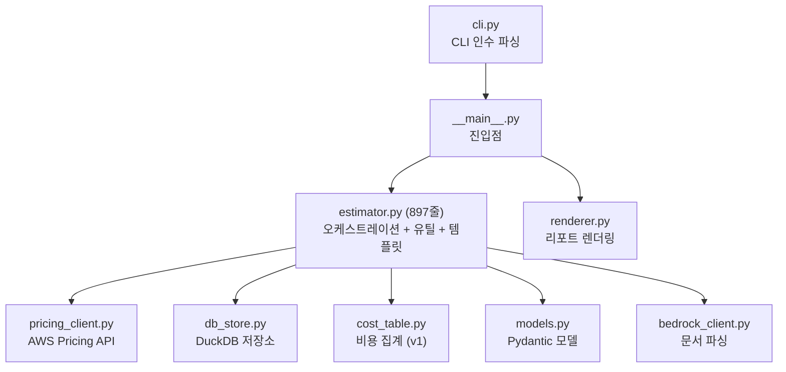
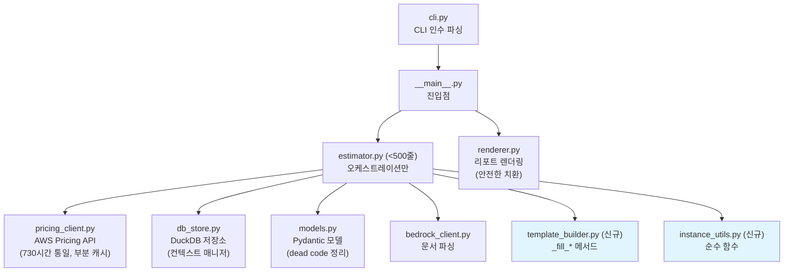

# 코드 품질 개선 설계 문서

## 개요

본 설계 문서는 RDS Cost Estimator 프로젝트의 코드 품질 개선을 위한 15개 요구사항에 대한 기술적 설계를 다룹니다. 개선 항목은 세 카테고리로 분류됩니다:

- **버그 수정** (요구사항 1, 5, 6, 14): 비용 계산 정확도, deprecated API, 렌더링 오류
- **설계 개선** (요구사항 2, 3, 4, 7, 8, 9, 11): 캐시, 모듈 분리, 리소스 관리, 리전 지원
- **일관성 개선** (요구사항 10, 12, 13, 15): dead code 정리, 데이터 정확도, 테스트 커버리지

### 코드 분석 요약

현재 코드베이스 분석 결과:

1. **월 시간 불일치**: `_parse_response`에서 RI 월정액을 `hourly_fee * 24 * 30.4375` (≈730.5시간)으로 계산하지만, `_parse_ri_response`와 `fetch_ri_offering`에서는 `hourly_fee * 730`을 사용. `CostRecord.compute_annual_cost`는 `730 * 12`를 사용.
2. **캐시 전부-아니면-전무(all-or-nothing)**: `fetch_all`에서 5개 PricingType 중 하나라도 캐시 미스면 전체를 다시 조회.
3. **v1 미사용**: `__main__.py`에서 `run_v2()`만 호출. `run()` (v1)은 사용되지 않음.
4. **템플릿 치환 위험**: `render_markdown_v2`에서 `template_content.replace("family_a", family_a)`로 단순 문자열 치환 → 템플릿 본문의 "family_a" 텍스트도 치환됨.
5. **asyncio deprecated**: `asyncio.get_event_loop()`가 pricing_client.py에서 5회 사용됨. Python 3.10+에서 deprecation 경고 발생.
6. **TCO 연도 오프셋**: `_fill_tco`에서 `year=0`부터 시작하여 `yearly_stor[0]`이 현재 크기 기준 비용 (증가율 미적용).
7. **DuckDBStore**: `__enter__`/`__exit__` 미구현. `run_v2()`에서 수동 `close()` 호출.
8. **estimator.py**: 897줄로 500줄 제한 초과.
9. **네트워크 기본값 키 누락**: `_fill_network_defaults`에 연도별 키(`net_total_monthly_1y` 등)가 있지만, `_fill_network_costs`에서 설정하는 일부 키가 누락될 수 있음.
10. **CostTable**: `compute_savings`가 `PricingType.RI_1YR`/`RI_3YR` (Partial Upfront)만 참조. v2의 No Upfront/All Upfront 타입 미지원.

---

## 아키텍처

### 현재 모듈 구조



### 개선 후 모듈 구조



### 설계 원칙

1. **하위 호환성 유지**: 외부 인터페이스(`run_v2()` 반환값, CLI 인수)는 변경하지 않음
2. **점진적 리팩토링**: 각 요구사항을 독립적으로 적용 가능하도록 설계
3. **단일 진실 원천(Single Source of Truth)**: 상수(`HOURS_PER_MONTH`)를 한 곳에서 정의
4. **리소스 안전성**: 컨텍스트 매니저로 DuckDB 연결 관리

---

## 컴포넌트 및 인터페이스

### 1. 월 시간 상수 통일 (요구사항 1)

**현재 문제**: `_parse_response`에서 `hourly_fee * 24 * 30.4375` (≈730.5), 다른 곳에서 `730` 사용.

**설계**:
- `models.py`에 `HOURS_PER_MONTH = 730` 상수 정의
- `pricing_client.py`의 모든 월 시간 계산에서 이 상수 참조
- `_parse_response`의 `hourly_fee * 24 * 30.4375` → `hourly_fee * HOURS_PER_MONTH`

```python
# models.py
HOURS_PER_MONTH = 730  # AWS 공식 기준: 365일/12개월 * 24시간 ≈ 730

# pricing_client.py - _parse_response 내부
monthly_fee = hourly_fee * HOURS_PER_MONTH  # 기존: hourly_fee * 24 * 30.4375
```

### 2. 부분 캐시 히트 (요구사항 2)

**현재 문제**: `fetch_all`에서 5개 PricingType 전체가 캐시에 있어야만 캐시 반환. 하나라도 없으면 전체 재조회.

**설계**:
- 캐시에 있는 PricingType은 즉시 수집
- 누락된 PricingType만 API 호출 후 파싱
- 캐시된 레코드와 새로 조회한 레코드를 병합하여 반환

```python
async def fetch_all(self, spec: InstanceSpec) -> list[CostRecord]:
    records: list[CostRecord] = []
    missing_types: list[PricingType] = []
    
    for pt in pricing_types:
        ck = self._cache_key(spec, pt)
        if ck in self._cache:
            records.append(self._cache[ck])
        else:
            missing_types.append(pt)
    
    if not missing_types:
        return records  # 전체 캐시 히트
    
    # API 호출은 한 번만 (missing_types에 대해서만 파싱)
    response = await self._fetch_products(spec)
    for pt in missing_types:
        record = self._parse_for_type(response, spec, pt)
        records.append(record)
    
    return records
```

### 3. v1/v2 패밀리 확장 통일 및 v1 정리 (요구사항 3, 9)

**현재 상태**: `__main__.py`에서 `run_v2()`만 호출. `run()` (v1)은 미사용.

**설계**:
- v1 `run()`, `_build_specs()` 메서드 제거
- `CostTable`, `CostTableRow` 등 v1 전용 모델은 v2에서도 `render_console`, `render_markdown`에서 사용되므로 유지 여부 확인 필요
- `CostTable`이 `render_console`/`render_markdown`에서만 사용되고 v2 경로에서 사용되지 않으면 함께 제거
- `fetch_reserved` (v1 전용 Partial Upfront 조회)도 제거 대상

**의존성 분석**:
- `renderer.py`의 `render_console`, `render_markdown`이 `CostTable`을 사용하지만, v2 경로에서는 `render_markdown_v2`만 사용
- `cost_table.py` 전체를 deprecated 처리하거나, v1 렌더러와 함께 제거

### 4. 템플릿 치환 안전성 (요구사항 4)

**현재 문제**: `template_content.replace("family_a", family_a)`가 템플릿 본문의 모든 "family_a" 문자열을 치환.

**설계**:
- 구분자 기반 치환: `{family_a}`, `{family_b}` 패턴만 매칭
- 1단계 치환을 정규식으로 변경

```python
# 기존 (위험)
result = template_content.replace("family_a", family_a).replace("family_b", family_b)

# 개선 (안전)
import re
result = re.sub(r'\bfamily_a\b', family_a, template_content)
result = re.sub(r'\bfamily_b\b', family_b, result)
```

단, 템플릿에서 `family_a`가 플레이스홀더 이름의 일부로 사용되는 경우(예: `{spec_family_a_od_monthly}`)도 있으므로, 이 패턴도 올바르게 치환되어야 합니다. 따라서 단순 `\bfamily_a\b` 대신, 템플릿의 실제 사용 패턴을 분석하여 적절한 정규식을 설계합니다.

### 5. asyncio deprecated API 교체 (요구사항 5)

**현재 문제**: `asyncio.get_event_loop()`가 5곳에서 사용됨. Python 3.10+에서 deprecated.

**설계**:
- `asyncio.get_event_loop()` → `asyncio.get_running_loop()` 교체
- `async` 함수 내부에서 호출되므로 `get_running_loop()`이 적합
- `__main__.py`의 `asyncio.run()`은 이미 올바른 패턴

```python
# 기존
loop = asyncio.get_event_loop()
response = await loop.run_in_executor(None, lambda: ...)

# 개선
loop = asyncio.get_running_loop()
response = await loop.run_in_executor(None, lambda: ...)
```

### 6. TCO 연도 오프셋 수정 (요구사항 6)

**현재 문제**: `_fill_tco`에서 `range(3)`으로 year=0,1,2를 순회. `yearly_stor[0]`은 현재 크기 기준(증가율 미적용).

**설계**:
- `range(3)` → `range(1, 4)`로 변경하여 1년차부터 시작
- `yearly_stor[0]`이 1년차(증가율 1회 적용) 비용을 나타내도록 수정

```python
# 기존
for year in range(3):
    size = db_size * (1 + growth_rate) ** year  # year=0: 현재 크기

# 개선
for year in range(1, 4):
    size = db_size * (1 + growth_rate) ** year  # year=1: 1년차 크기
```

### 7. DuckDBStore 컨텍스트 매니저 (요구사항 7)

**설계**:
```python
class DuckDBStore:
    def __enter__(self) -> "DuckDBStore":
        return self
    
    def __exit__(self, exc_type, exc_val, exc_tb) -> None:
        self.close()
```

`estimator.py`의 `run_v2()`에서:
```python
# 기존
self._db_store = DuckDBStore()
# ... 작업 ...
self._db_store.close()

# 개선
with DuckDBStore() as store:
    self._db_store = store
    # ... 작업 ...
```

### 8. estimator.py 모듈 분리 (요구사항 8)

**현재**: 897줄 (500줄 제한 초과)

**분리 계획**:

| 대상 | 이동할 모듈 | 줄 수 (추정) |
|------|------------|-------------|
| `get_instance_specs`, `extract_family_and_size`, `expand_instance_families`, `find_matching_instance`, `calc_storage_costs`, 사양 테이블 상수 | `instance_utils.py` | ~180줄 |
| `_fill_storage_costs`, `_fill_network_costs`, `_fill_network_defaults`, `_fill_instance_specs`, `_fill_pricing`, `_fill_comparison`, `_fill_tco`, `_build_template_data` | `template_builder.py` | ~350줄 |
| `Estimator` 클래스 (오케스트레이션만) | `estimator.py` | ~370줄 |

`template_builder.py`는 `TemplateBuilder` 클래스 또는 독립 함수 모음으로 구성. `Estimator`에서 위임 호출.

### 9. 불필요한 인스턴스 사이즈 제거 (요구사항 10)

**현재 문제**: `_SIZE_SPECS`(r 계열)에 `micro`, `small`, `medium`이 포함되어 있으나, AWS RDS의 r 계열은 `large` 이상만 제공.

**설계**:
- `_SIZE_SPECS`에서 `micro`, `small`, `medium` 제거
- `_T_SIZE_SPECS`는 `micro`~`2xlarge` 유지 (t3/t4g는 실제로 이 사이즈 제공)
- `_M_SIZE_SPECS`는 `large`~`24xlarge` 유지

### 10. 리전별 스토리지/네트워크 요금 (요구사항 11)

**설계**:
- 리전별 요금 설정 파일(`region_pricing.json`) 또는 딕셔너리 도입
- `calc_storage_costs`에 `region` 파라미터 추가
- 기본값은 현재 `ap-northeast-2` 요금 유지

```python
REGION_STORAGE_PRICING = {
    "ap-northeast-2": {"gp3_per_gb": 0.08, "cross_az_per_gb": 0.01, "cross_region_per_gb": 0.02},
    "us-east-1": {"gp3_per_gb": 0.08, "cross_az_per_gb": 0.01, "cross_region_per_gb": 0.02},
    # ... 기타 리전
}
```

### 11. Dead code 정리 (요구사항 12, 13)

**분석 결과**:
- `PricingType.RI_1YR` (Partial Upfront): `_parse_response`와 `fetch_reserved`에서만 사용 → v1 전용
- `PricingType.RI_3YR` (Partial Upfront): 동일
- `CostTable.compute_savings`: `PricingType.RI_1YR`/`RI_3YR`만 참조 → v1 전용

**설계**: v1 제거 시 함께 정리. v1 유지 시 deprecated 표시.

### 12. 네트워크 기본값 키 누락 (요구사항 14)

**현재 문제**: `_fill_network_costs`에서 설정하는 키 중 일부가 `_fill_network_defaults`에 누락.

**설계**:
- `_fill_network_costs`에서 설정하는 모든 키를 열거
- `_fill_network_defaults`에 동일한 키 목록으로 기본값 `"0.00"` 설정
- 누락 키 목록: `net_total_monthly_1y`, `net_total_monthly_2y`, `net_total_monthly_3y` 등은 이미 있으나, 추가 확인 필요

### 13. Replatform vs Refactoring 비용 비교 (요구사항 16)

**현재 상태**: `run_v2()`에서 `args.engine` (기본값 `oracle-ee`) 하나의 엔진으로만 가격 조회. `MigrationStrategy.REFACTORING`은 v2에서 미사용. 템플릿에 이관 전략 비교 섹션 없음.

**설계**:

#### 13-1. 가격 조회 확장 (`estimator.py`)

`run_v2()`에서 소스 엔진이 Oracle 계열일 때, 동일 인스턴스 사이즈로 Aurora PostgreSQL 가격도 병렬 조회:

```python
# run_v2() 내부 - 기존 Replatform 스펙 생성 후
if args.engine in ORACLE_ENGINES:
    # Refactoring 스펙 추가: 동일 인스턴스, aurora-postgresql 엔진
    for inst in target_instances:
        for deploy in ["Single-AZ", "Multi-AZ"]:
            all_specs.append(InstanceSpec(
                instance_type=inst,
                region=args.region,
                engine=REFACTORING_ENGINE,  # "aurora-postgresql"
                strategy=MigrationStrategy.REFACTORING,
                deployment_option=deploy,
            ))
```

#### 13-2. 템플릿 데이터 구성 (`_build_template_data`)

Refactoring 가격 데이터를 별도 키로 data에 추가:

```python
# price_index에서 Refactoring 레코드 조회
# 키 패턴: refac_{family}_{opt}_monthly, refac_{family}_{opt}_total_yearly
# 예: refac_r6i_od_monthly, refac_r6i_ri3au_total_yearly

def _fill_refactoring_comparison(self, data: dict, price_index: dict,
                                  instances: dict[str, str],
                                  families: list[str]) -> None:
    """Replatform vs Refactoring 비용 비교 데이터를 채웁니다."""
    stor_monthly = float(data.get("stor_total_0y", "0").replace(",", ""))
    net_monthly = float(data.get("net_monthly", "0").replace(",", ""))

    for family in families:
        inst = instances.get(family)
        if not inst:
            continue

        for opt_key, pt in pricing_options:
            # Replatform 비용 (이미 계산됨)
            replat_key = f"sga_{family}_{opt_key}_total_yearly"
            replat_yearly = data.get(replat_key, "N/A")

            # Refactoring 비용 (aurora-postgresql 엔진)
            refac_monthly = self._get_monthly_by_engine(
                price_index, inst, "Single-AZ", pt, REFACTORING_ENGINE
            )
            if refac_monthly is not None:
                refac_total_m = refac_monthly + stor_monthly + net_monthly
                refac_total_y = refac_total_m * 12
                data[f"refac_{family}_{opt_key}_monthly"] = f"{refac_monthly:,.2f}"
                data[f"refac_{family}_{opt_key}_total_yearly"] = f"{refac_total_y:,.2f}"

                # 절감액/절감률 계산
                if replat_yearly != "N/A":
                    replat_y = float(replat_yearly.replace(",", ""))
                    savings = replat_y - refac_total_y
                    savings_rate = (savings / replat_y * 100) if replat_y > 0 else 0
                    data[f"refac_{family}_{opt_key}_savings"] = f"{savings:,.2f}"
                    data[f"refac_{family}_{opt_key}_savings_rate"] = f"{savings_rate:.1f}"
            else:
                data[f"refac_{family}_{opt_key}_monthly"] = "N/A"
                data[f"refac_{family}_{opt_key}_total_yearly"] = "N/A"
                data[f"refac_{family}_{opt_key}_savings"] = "N/A"
                data[f"refac_{family}_{opt_key}_savings_rate"] = "N/A"
```

#### 13-3. price_index 키 확장

현재 `price_index`의 키는 `(instance_type, deployment_option, pricing_type)`. Refactoring 레코드는 동일 인스턴스지만 다른 엔진이므로, 키에 엔진을 추가하거나 별도 인덱스를 사용:

```python
# 방법 1: 키에 엔진 추가 (기존 코드 변경 최소화)
# price_index 키: (instance_type, deployment_option, pricing_type, engine)
# → 기존 조회 코드에 engine 파라미터 추가 필요

# 방법 2: Refactoring 전용 인덱스 (기존 코드 변경 없음)
refac_price_index: dict[tuple[str, str, PricingType], CostRecord] = {}
for rec in all_records:
    if rec.spec.strategy == MigrationStrategy.REFACTORING:
        key = (rec.spec.instance_type, rec.spec.deployment_option, rec.pricing_type)
        refac_price_index[key] = rec
```

방법 2가 기존 코드 변경을 최소화하므로 채택.

#### 13-4. 템플릿 섹션 추가 (`cost_report_template_v2.md`)

섹션 7과 8 사이에 "이관 전략별 비용 비교" 섹션 추가:

```markdown
## 8. 이관 전략별 비용 비교 (Oracle → RDS for Oracle vs Aurora PostgreSQL)

> 동일 인스턴스 사이즈에서 RDS for Oracle(Replatform)과 Aurora PostgreSQL(Refactoring)의
> 비용을 비교합니다. SGA 최적화 기준 인스턴스를 사용합니다.

### {family_a} 계열 ({sga_family_a_instance}) — Single-AZ

| 요금 옵션 | RDS for Oracle (연간) | Aurora PostgreSQL (연간) | 절감액 | 절감률 |
|-----------|---------------------|------------------------|--------|--------|
| On-Demand | ${comp_sga_family_a_od} | ${refac_family_a_od_total_yearly} | ${refac_family_a_od_savings} | {refac_family_a_od_savings_rate}% |
| 1년 RI (All Upfront) | ${comp_sga_family_a_ri1au} | ${refac_family_a_ri1au_total_yearly} | ${refac_family_a_ri1au_savings} | {refac_family_a_ri1au_savings_rate}% |
| 3년 RI (All Upfront) | ${comp_sga_family_a_ri3au} | ${refac_family_a_ri3au_total_yearly} | ${refac_family_a_ri3au_savings} | {refac_family_a_ri3au_savings_rate}% |

### {family_b} 계열 ({sga_family_b_instance}) — Single-AZ

| 요금 옵션 | RDS for Oracle (연간) | Aurora PostgreSQL (연간) | 절감액 | 절감률 |
|-----------|---------------------|------------------------|--------|--------|
| On-Demand | ${comp_sga_family_b_od} | ${refac_family_b_od_total_yearly} | ${refac_family_b_od_savings} | {refac_family_b_od_savings_rate}% |
| 1년 RI (All Upfront) | ${comp_sga_family_b_ri1au} | ${refac_family_b_ri1au_total_yearly} | ${refac_family_b_ri1au_savings} | {refac_family_b_ri1au_savings_rate}% |
| 3년 RI (All Upfront) | ${comp_sga_family_b_ri3au} | ${refac_family_b_ri3au_total_yearly} | ${refac_family_b_ri3au_savings} | {refac_family_b_ri3au_savings_rate}% |

> 💡 Aurora PostgreSQL은 Oracle 대비 라이선스 비용이 없어 인스턴스 비용이 크게 절감됩니다.
> 단, PL/SQL → PL/pgSQL 변환 등 애플리케이션 코드 수정 비용은 별도 고려가 필요합니다.
```

#### 13-5. 조건부 렌더링

소스 엔진이 Oracle이 아닌 경우 이 섹션의 플레이스홀더에 기본값을 설정:

```python
if args.engine not in ORACLE_ENGINES:
    data["refac_section_visible"] = False
    # 모든 refac_ 키에 "N/A" 기본값 설정
```

템플릿에서는 조건부 렌더링이 어려우므로, 렌더러에서 `refac_section_visible=False`일 때 해당 섹션을 제거하는 후처리 추가.

---

## 데이터 모델

### 변경되는 모델

#### models.py 변경사항

```python
# 신규 상수
HOURS_PER_MONTH = 730  # AWS 공식 월 시간 기준

# PricingType - v1 제거 시
class PricingType(str, Enum):
    ON_DEMAND = "on_demand"
    RI_1YR_NO_UPFRONT = "1yr_no_upfront"
    RI_1YR_ALL_UPFRONT = "1yr_all_upfront"
    RI_3YR_NO_UPFRONT = "3yr_no_upfront"
    RI_3YR_ALL_UPFRONT = "3yr_all_upfront"
    # RI_1YR, RI_3YR 제거 (v1 전용 Partial Upfront)
```

#### instance_utils.py (신규)

```python
# estimator.py에서 이동
INSTANCE_PATTERN: re.Pattern
GP3_STORAGE_PER_GB: float
GP3_IOPS_PER_UNIT: float
GP3_THROUGHPUT_PER_MBPS: float
NET_CROSS_AZ_PER_GB: float
NET_CROSS_REGION_PER_GB: float

_SIZE_SPECS: dict  # r 계열 (large 이상만)
_M_SIZE_SPECS: dict  # m 계열
_T_SIZE_SPECS: dict  # t 계열

def get_instance_specs(instance_type: str) -> dict | None
def extract_family_and_size(instance_type: str) -> tuple[str, str] | None
def expand_instance_families(instance_type: str, exclude_graviton: bool = False) -> list[str]
def find_matching_instance(memory_gb: float, family: str = "r6i") -> str | None
def calc_storage_costs(db_size_gb: float, ...) -> dict
```

#### template_builder.py (신규)

```python
class TemplateBuilder:
    """템플릿 v2 데이터 구성 클래스."""
    
    def __init__(self, db_store: DuckDBStore | None, args: CLIArgs):
        ...
    
    def build(self, parsed: ParsedDocumentInfo, price_index: dict, ...) -> dict:
        """전체 템플릿 데이터를 구성합니다."""
        ...
    
    def _fill_storage_costs(self, data: dict, ...) -> None: ...
    def _fill_network_costs(self, data: dict, ...) -> None: ...
    def _fill_network_defaults(self, data: dict) -> None: ...
    def _fill_instance_specs(self, data: dict, ...) -> None: ...
    def _fill_pricing(self, data: dict, ...) -> None: ...
    def _fill_comparison(self, data: dict, ...) -> None: ...
    def _fill_tco(self, data: dict, ...) -> None: ...
```

#### 리전별 요금 구조

```python
@dataclass
class RegionPricing:
    gp3_storage_per_gb: float = 0.08
    gp3_iops_per_unit: float = 0.02
    gp3_throughput_per_mbps: float = 0.04
    cross_az_per_gb: float = 0.01
    cross_region_per_gb: float = 0.02
```


---

## 정확성 속성 (Correctness Properties)

*속성(property)은 시스템의 모든 유효한 실행에서 참이어야 하는 특성 또는 동작입니다. 속성은 사람이 읽을 수 있는 명세와 기계가 검증할 수 있는 정확성 보장 사이의 다리 역할을 합니다.*

### Property 1: 월 시간 기준 일관성

*For any* 양수 hourly_rate에 대해, `CostRecord`의 온디맨드 annual_cost는 `hourly_rate * 730 * 12`와 같아야 하고, RI 파싱 시 monthly_fee는 `hourly_fee * 730`과 같아야 합니다.

**Validates: Requirements 1.2, 1.3**

### Property 2: 부분 캐시 히트 완전성

*For any* PricingType 부분 집합이 캐시에 존재하는 상태에서 `fetch_all`을 호출하면, 반환된 레코드 목록은 항상 모든 요청된 PricingType을 포함해야 하고, 캐시에 있던 항목의 값은 캐시된 값과 동일해야 합니다.

**Validates: Requirements 2.1, 2.2**

### Property 3: 템플릿 치환 안전성

*For any* 템플릿 문자열에서, 플레이스홀더 위치(예: `{spec_family_a_od_monthly}` 내의 `family_a`)의 "family_a"는 실제 패밀리명으로 치환되어야 하고, 일반 텍스트 위치의 "family_a" 문자열(예: 설명문 내)은 치환되지 않아야 합니다.

**Validates: Requirements 4.2**

### Property 4: TCO 연도별 스토리지 비용 증가

*For any* 양수 db_size와 양수 growth_rate에 대해, TCO의 1년차 스토리지 비용은 `db_size * (1 + growth_rate)` 기준으로 계산되어야 하고, 각 연도의 스토리지 비용은 이전 연도보다 커야 합니다.

**Validates: Requirements 6.1**

### Property 5: DuckDBStore 컨텍스트 매니저 리소스 해제

*For any* DuckDBStore 인스턴스에 대해, `with` 문으로 사용한 후 블록이 종료되면(정상 종료 또는 예외 발생 모두) `close()`가 호출되어 연결이 해제되어야 합니다.

**Validates: Requirements 7.1, 7.2**

### Property 6: 리전별 스토리지 요금 반영

*For any* 지원되는 리전과 양수 db_size에 대해, `calc_storage_costs`는 해당 리전의 gp3 요금을 사용하여 계산해야 하고, 서로 다른 요금을 가진 리전에서는 다른 결과를 반환해야 합니다.

**Validates: Requirements 11.2**

### Property 7: 네트워크 기본값 키 완전성

*For any* 템플릿에서 사용되는 네트워크 관련 플레이스홀더에 대해, 네트워크 데이터가 없을 때 `_fill_network_defaults`가 설정하는 키 집합은 `_fill_network_costs`가 설정하는 키 집합의 상위 집합이어야 하며, 기본값으로 렌더링 시 미치환 플레이스홀더가 남지 않아야 합니다.

**Validates: Requirements 14.1, 14.2, 14.3**

### Property 8: Replatform vs Refactoring 비교 완전성

*For any* Oracle 소스 엔진과 유효한 인스턴스 사이즈에 대해, Refactoring(Aurora PostgreSQL) 가격 조회가 성공하면 비교 섹션의 모든 요금 옵션(On-Demand, 1년 RI, 3년 RI)에 대해 Replatform 비용, Refactoring 비용, 절감액, 절감률이 모두 채워져야 합니다. 절감률은 `(Replatform 비용 - Refactoring 비용) / Replatform 비용 × 100`과 같아야 합니다.

**Validates: Requirements 16.4, 16.5**

### Property 9: 비Oracle 엔진 시 Refactoring 섹션 비활성

*For any* Oracle이 아닌 소스 엔진에 대해, Refactoring 비교 섹션은 생성되지 않거나 "해당 없음"으로 표시되어야 하며, Refactoring 가격 조회가 수행되지 않아야 합니다.

**Validates: Requirements 16.6**

---

## 에러 처리

### 기존 에러 처리 유지

- `PricingAPIError`: AWS Pricing API 호출 실패 시 발생
- `PricingDataNotFoundError`: 가격 데이터 미존재 시 발생
- `InvalidInputError`: 잘못된 입력값 시 발생

### 추가 에러 처리

| 시나리오 | 처리 방식 |
|---------|----------|
| 부분 캐시 히트 중 API 실패 | 실패한 PricingType만 `is_available=False`로 처리, 캐시된 항목은 정상 반환 |
| DuckDBStore `__exit__`에서 close() 실패 | 예외를 로깅하되 전파하지 않음 (리소스 정리 실패가 비즈니스 로직에 영향 주지 않도록) |
| 리전별 요금 조회 실패 | 기본값(`ap-northeast-2` 요금)으로 폴백, 경고 로그 출력 |
| 템플릿 치환 시 알 수 없는 플레이스홀더 | 원본 유지 (기존 동작과 동일) |
| v1 메서드 호출 시도 (제거 후) | `AttributeError` 발생 (의도적 - v1 사용자에게 마이그레이션 필요 알림) |

---

## 테스트 전략

### 이중 테스트 접근법

본 프로젝트는 **단위 테스트(unit test)**와 **속성 기반 테스트(property-based test)**를 병행합니다.

- **단위 테스트**: 구체적인 예시, 엣지 케이스, 에러 조건 검증
- **속성 기반 테스트**: 모든 입력에 대해 보편적으로 성립하는 속성 검증
- 두 접근법은 상호 보완적이며, 단위 테스트는 구체적 버그를, 속성 테스트는 일반적 정확성을 검증합니다

### 속성 기반 테스트 라이브러리

- **Hypothesis** (Python): `hypothesis` 라이브러리 사용
- 각 속성 테스트는 최소 100회 반복 실행
- 각 테스트에 설계 문서의 속성 번호를 태그로 포함

```python
# 태그 형식 예시
# Feature: code-quality-improvements, Property 1: 월 시간 기준 일관성
```

### 테스트 파일 구조

```
tests/
├── test_estimator.py          # 기존 테스트 (리팩토링 후 업데이트)
├── test_db_store.py           # DuckDBStore 테스트 (컨텍스트 매니저 추가)
├── test_instance_utils.py     # 신규: instance_utils.py 테스트
├── test_template_builder.py   # 신규: template_builder.py 테스트
├── test_renderer.py           # 신규: 템플릿 치환 안전성 테스트
├── test_pricing_client.py     # 신규: 부분 캐시, 월 시간 기준 테스트
└── test_properties.py         # 신규: 속성 기반 테스트 (Hypothesis)
```

### 단위 테스트 항목

| 테스트 대상 | 검증 내용 |
|------------|----------|
| `HOURS_PER_MONTH` 상수 | 값이 730인지 확인 |
| `_parse_response` RI 계산 | 특정 hourly_fee에 대한 monthly_fee 값 검증 |
| `fetch_all` 부분 캐시 | 3개 캐시 + 2개 미스 시나리오 |
| `render_markdown_v2` 치환 | "family_a" 일반 텍스트 미치환 확인 |
| `asyncio.get_running_loop()` | deprecation 경고 미발생 확인 |
| `_fill_tco` 연도 오프셋 | 1년차 비용이 증가율 반영된 값인지 확인 |
| `DuckDBStore` 컨텍스트 매니저 | `with` 문 후 close() 호출 확인 |
| `_fill_network_defaults` 키 | 모든 필수 키 존재 확인 |
| 모듈 분리 후 import | `instance_utils`, `template_builder` import 정상 확인 |

### 속성 기반 테스트 항목

| 속성 | Hypothesis 전략 | 최소 반복 |
|------|----------------|----------|
| Property 1: 월 시간 기준 일관성 | `st.floats(min_value=0.01, max_value=1000)` | 100 |
| Property 2: 부분 캐시 히트 완전성 | `st.sets(st.sampled_from(PricingType))` | 100 |
| Property 3: 템플릿 치환 안전성 | `st.text()` (패밀리명, 템플릿 내용) | 100 |
| Property 4: TCO 연도별 스토리지 증가 | `st.floats(min_value=1, max_value=10000)` × `st.floats(min_value=0.01, max_value=1.0)` | 100 |
| Property 5: 컨텍스트 매니저 리소스 해제 | `st.just(DuckDBStore(":memory:"))` | 100 |
| Property 6: 리전별 스토리지 요금 | `st.sampled_from(supported_regions)` × `st.floats(min_value=1, max_value=10000)` | 100 |
| Property 7: 네트워크 기본값 키 완전성 | 키 집합 비교 (고정 테스트) | 100 |

### 각 속성 테스트의 태그 형식

```python
# Feature: code-quality-improvements, Property 1: 월 시간 기준 일관성
@given(hourly_rate=st.floats(min_value=0.01, max_value=1000, allow_nan=False))
@settings(max_examples=100)
def test_property_1_hours_per_month_consistency(hourly_rate):
    """모든 비용 계산 경로에서 HOURS_PER_MONTH = 730을 사용하는지 검증."""
    ...

# Feature: code-quality-improvements, Property 2: 부분 캐시 히트 완전성
@given(cached_types=st.sets(st.sampled_from(PRICING_TYPES)))
@settings(max_examples=100)
def test_property_2_partial_cache_completeness(cached_types):
    """부분 캐시 상태에서 fetch_all이 모든 PricingType을 반환하는지 검증."""
    ...

# Feature: code-quality-improvements, Property 3: 템플릿 치환 안전성
@given(family_name=st.text(min_size=1, max_size=10, alphabet=st.characters(whitelist_categories=('Ll', 'Nd'))))
@settings(max_examples=100)
def test_property_3_template_substitution_safety(family_name):
    """플레이스홀더만 치환되고 일반 텍스트는 보존되는지 검증."""
    ...

# Feature: code-quality-improvements, Property 4: TCO 연도별 스토리지 비용 증가
@given(
    db_size=st.floats(min_value=1, max_value=10000, allow_nan=False),
    growth_rate=st.floats(min_value=0.01, max_value=1.0, allow_nan=False),
)
@settings(max_examples=100)
def test_property_4_tco_yearly_storage_increase(db_size, growth_rate):
    """TCO 1년차 스토리지가 증가율 반영된 값인지 검증."""
    ...

# Feature: code-quality-improvements, Property 5: DuckDBStore 컨텍스트 매니저 리소스 해제
@given(st.just(None))
@settings(max_examples=100)
def test_property_5_context_manager_resource_release(_):
    """with 문 종료 시 close()가 호출되는지 검증."""
    ...

# Feature: code-quality-improvements, Property 6: 리전별 스토리지 요금 반영
@given(
    region=st.sampled_from(list(REGION_STORAGE_PRICING.keys())),
    db_size=st.floats(min_value=1, max_value=10000, allow_nan=False),
)
@settings(max_examples=100)
def test_property_6_region_specific_storage_pricing(region, db_size):
    """리전별 요금이 올바르게 반영되는지 검증."""
    ...

# Feature: code-quality-improvements, Property 7: 네트워크 기본값 키 완전성
@given(st.just(None))
@settings(max_examples=100)
def test_property_7_network_defaults_key_completeness(_):
    """기본값 키 집합이 비용 키 집합의 상위 집합인지 검증."""
    ...
```
