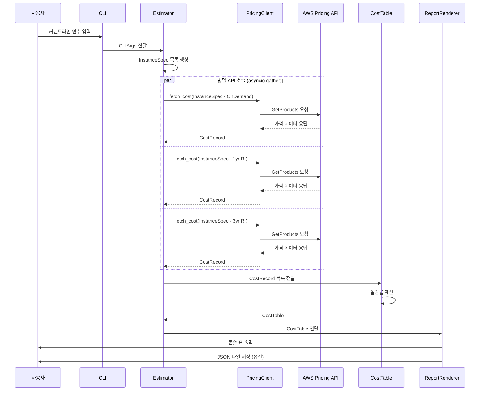
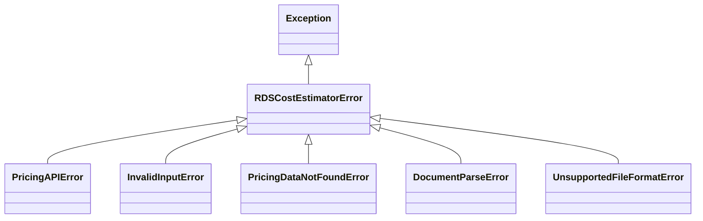
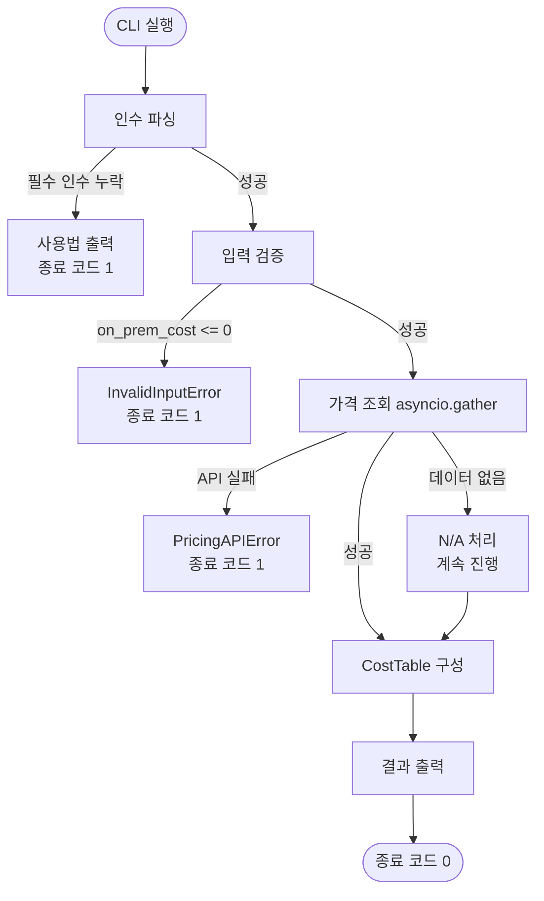

# 기술 설계 문서: RDS Cost Estimator

## 개요

RDS Cost Estimator는 온프레미스 데이터베이스 서버를 AWS RDS로 이관할 때 예상 비용을 분석하는 Python CLI 도구입니다.

AWS Pricing API를 비동기로 호출하여 r6i, r7i, r7g 인스턴스 패밀리의 온디맨드 및 예약 인스턴스(RI) 가격을 수집하고,
Replatform(RDS for Oracle)과 Refactoring(Aurora PostgreSQL) 두 가지 이관 전략의 연간 비용을 비교합니다.
온프레미스 유지비용 대비 절감률을 계산하여 의사결정자가 이관 전략을 선택하는 데 필요한 근거 자료를 제공합니다.

### 핵심 설계 원칙

- **비동기 병렬 처리**: `asyncio`를 활용하여 여러 인스턴스 유형의 API 호출을 동시에 수행
- **캐싱**: 동일 인스턴스 사양에 대한 중복 API 호출 방지
- **타입 안전성**: Pydantic v2 모델로 모든 입력/출력 데이터 검증
- **모듈화**: 기능 단위로 분리된 모듈 구조로 유지보수성 확보

---

## 아키텍처

### 컴포넌트 다이어그램

```mermaid
graph TD
    CLI["CLI 진입점<br/>(cli.py / __main__.py)"]
    Estimator["Estimator<br/>(estimator.py)"]
    DocumentParser["DocumentParser<br/>(document_parser.py)"]
    BedrockClient["BedrockClient<br/>(bedrock_client.py)"]
    PricingClient["PricingClient<br/>(pricing_client.py)"]
    CostTable["CostTable<br/>(cost_table.py)"]
    ReportRenderer["ReportRenderer<br/>(renderer.py)"]
    Models["Pydantic 모델<br/>(models.py)"]
    Exceptions["예외 클래스<br/>(exceptions.py)"]
    AWSPricingAPI["AWS Pricing API<br/>(us-east-1)"]
    AWSBedrock["AWS Bedrock Runtime<br/>(Claude 모델)"]
    Cache["인메모리 캐시<br/>(dict)"]

    CLI -->|CLIArgs| Estimator
    CLI -->|input_file 경로| DocumentParser
    DocumentParser -->|텍스트 추출 후 호출| BedrockClient
    BedrockClient -->|InvokeModel| AWSBedrock
    AWSBedrock -->|JSON 응답| BedrockClient
    BedrockClient -->|ParsedDocumentInfo| DocumentParser
    DocumentParser -->|ParsedDocumentInfo| Estimator
    Estimator -->|InstanceSpec| PricingClient
    Estimator -->|List[CostRecord]| CostTable
    Estimator -->|CostTable| ReportRenderer
    PricingClient -->|HTTP| AWSPricingAPI
    PricingClient <-->|캐시 조회/저장| Cache
    PricingClient -->|CostRecord| Estimator
    Models -.->|사용| PricingClient
    Models -.->|사용| CostTable
    Models -.->|사용| Estimator
    Models -.->|사용| DocumentParser
    Exceptions -.->|발생| PricingClient
    Exceptions -.->|발생| Estimator
    Exceptions -.->|발생| DocumentParser
    Exceptions -.->|발생| BedrockClient
```

### 데이터 흐름 다이어그램



---

## 컴포넌트 및 인터페이스

### 디렉토리 레이아웃

```
rds-cost-estimator/
├── pyproject.toml
├── README.md
└── src/
    └── rds_cost_estimator/
        ├── __init__.py
        ├── __main__.py          # python -m rds_cost_estimator 진입점
        ├── cli.py               # argparse CLI 정의
        ├── estimator.py         # 핵심 오케스트레이션 로직
        ├── pricing_client.py    # AWS Pricing API 클라이언트
        ├── cost_table.py        # 비용 집계 및 절감률 계산
        ├── renderer.py          # 콘솔 표 및 JSON 출력
        ├── models.py            # Pydantic v2 데이터 모델
        ├── exceptions.py        # 커스텀 예외 클래스
        ├── document_parser.py   # 문서 파일 텍스트 추출 + Bedrock 파싱
        └── bedrock_client.py    # AWS Bedrock Runtime 클라이언트
```

### 모듈별 책임

| 모듈 | 책임 |
|------|------|
| `cli.py` | argparse를 통한 CLI 인수 파싱, CLIArgs 모델 반환 |
| `estimator.py` | InstanceSpec 생성, 병렬 API 호출 조율, CostTable 구성 |
| `pricing_client.py` | AWS Pricing API 호출, 캐싱, CostRecord 파싱 |
| `cost_table.py` | CostRecord 집계, 절감률 계산, CostTable 생성 |
| `renderer.py` | 콘솔 표 렌더링, JSON 파일 저장 |
| `models.py` | 모든 Pydantic v2 데이터 모델 정의 |
| `exceptions.py` | 커스텀 예외 클래스 계층 정의 |
| `document_parser.py` | 파일 형식별 텍스트 추출, BedrockClient 호출, ParsedDocumentInfo 반환 |
| `bedrock_client.py` | AWS Bedrock Runtime InvokeModel 호출, 응답 JSON 파싱 |

### PricingClient 인터페이스

```python
class PricingClient:
    def __init__(self, session: boto3.Session, cache: dict[str, CostRecord]) -> None: ...

    async def fetch_on_demand(self, spec: InstanceSpec) -> CostRecord: ...
    async def fetch_reserved(self, spec: InstanceSpec, term: Literal["1yr", "3yr"]) -> CostRecord: ...
    async def fetch_all(self, spec: InstanceSpec) -> list[CostRecord]: ...

    def _build_filters(self, spec: InstanceSpec, term_type: str) -> list[dict]: ...
    def _parse_response(self, response: dict, spec: InstanceSpec, pricing_type: PricingType) -> CostRecord: ...
    def _cache_key(self, spec: InstanceSpec, pricing_type: PricingType) -> str: ...
```

### Estimator 인터페이스

```python
class Estimator:
    def __init__(self, args: CLIArgs) -> None: ...

    async def run(self) -> CostTable: ...
    def _build_specs(self) -> list[InstanceSpec]: ...
```

### CostTable 인터페이스

```python
class CostTable:
    def __init__(self, records: list[CostRecord], on_prem_annual_cost: float) -> None: ...

    def compute_savings(self) -> list[CostRow]: ...
    def to_dict(self) -> list[dict]: ...
```

### ReportRenderer 인터페이스

```python
class ReportRenderer:
    @staticmethod
    def render_console(table: CostTable) -> None: ...

    @staticmethod
    def render_json(table: CostTable, output_path: str) -> None: ...
```

### DocumentParser 인터페이스

```python
class DocumentParser:
    def __init__(self, bedrock_client: "BedrockClient") -> None: ...

    def parse(self, file_path: str) -> ParsedDocumentInfo:
        """파일 형식을 감지하고 텍스트를 추출한 뒤 Bedrock으로 파싱"""
        ...

    def _extract_text(self, file_path: str) -> str:
        """파일 형식별 텍스트 추출 (PDF: pypdf, DOCX: python-docx, TXT: 직접 읽기)"""
        ...

    def _detect_format(self, file_path: str) -> Literal["pdf", "docx", "txt"]:
        """파일 확장자로 형식 감지, 비지원 형식이면 UnsupportedFileFormatError 발생"""
        ...
```

### BedrockClient 인터페이스

```python
class BedrockClient:
    def __init__(self, session: boto3.Session, model_id: str) -> None: ...

    def invoke(self, document_text: str) -> ParsedDocumentInfo:
        """Bedrock Claude 모델을 호출하여 문서에서 인스턴스 사양 정보를 추출"""
        ...

    def _build_prompt(self, document_text: str) -> str:
        """구조화된 JSON 출력을 요청하는 프롬프트 생성"""
        ...

    def _parse_response(self, response_body: dict) -> ParsedDocumentInfo:
        """Bedrock 응답에서 JSON을 추출하여 ParsedDocumentInfo로 변환"""
        ...
```

### 파일 형식별 텍스트 추출 방식

| 파일 형식 | 확장자 | 라이브러리 | 처리 방식 |
|-----------|--------|-----------|-----------|
| PDF | `.pdf` | `pypdf` | `PdfReader`로 페이지별 텍스트 추출 후 결합 |
| Word | `.docx` | `python-docx` | `Document`로 단락(paragraph) 텍스트 추출 후 결합 |
| 텍스트 | `.txt` | 내장 `open()` | UTF-8로 직접 읽기 |

### Bedrock 프롬프트 설계

Bedrock에 전달하는 프롬프트는 구조화된 JSON 출력을 명시적으로 요청합니다:

```
다음 문서에서 서버/인스턴스 사양 정보를 추출하여 아래 JSON 형식으로만 응답하세요.
찾을 수 없는 필드는 null로 표시하세요.

{
  "current_instance": "현재 인스턴스 유형 (예: db.r6i.xlarge)",
  "recommended_instance": "권장 인스턴스 유형 (없으면 null)",
  "on_prem_cost": 온프레미스 연간 유지비용 숫자 (USD, 없으면 null),
  "engine": "DB 엔진 (예: oracle-ee, aurora-postgresql, 없으면 null)",
  "metadata": {}
}

문서 내용:
{document_text}
```

---

## 데이터 모델

### Pydantic v2 모델 정의

```python
from enum import Enum
from pydantic import BaseModel, Field, field_validator
from typing import Optional

class InstanceFamily(str, Enum):
    R6I = "r6i"
    R7I = "r7i"
    R7G = "r7g"

class MigrationStrategy(str, Enum):
    REPLATFORM = "replatform"   # RDS for Oracle
    REFACTORING = "refactoring" # Aurora PostgreSQL

class PricingType(str, Enum):
    ON_DEMAND = "on_demand"
    RI_1YR = "1yr_partial_upfront"
    RI_3YR = "3yr_partial_upfront"

class InstanceSpec(BaseModel):
    """인스턴스 사양 - API 조회 키로 사용"""
    instance_type: str                    # 예: "db.r6i.xlarge"
    region: str                           # 예: "ap-northeast-2"
    engine: str                           # 예: "oracle-ee", "aurora-postgresql"
    strategy: MigrationStrategy

class CostRecord(BaseModel):
    """단일 인스턴스의 특정 요금제 비용 정보"""
    spec: InstanceSpec
    pricing_type: PricingType
    hourly_rate: Optional[float] = None   # 온디맨드 시간당 요금 (USD)
    upfront_fee: Optional[float] = None   # RI 선결제 금액 (USD)
    monthly_fee: Optional[float] = None   # RI 월정액 (USD)
    annual_cost: Optional[float] = None   # 연간 총비용 (USD)
    is_available: bool = True             # 가격 데이터 존재 여부

    @field_validator("annual_cost", mode="before")
    @classmethod
    def compute_annual_cost(cls, v, info) -> Optional[float]:
        """annual_cost가 없으면 자동 계산"""
        ...

class CostRow(BaseModel):
    """비교표의 단일 행 - 하나의 인스턴스 + 전략 조합"""
    instance_type: str
    strategy: MigrationStrategy
    on_demand_annual: Optional[float]
    ri_1yr_annual: Optional[float]
    ri_3yr_annual: Optional[float]
    on_prem_annual_cost: float
    savings_rate_on_demand: Optional[float]  # 온프레미스 대비 절감률 (%)
    savings_rate_ri_1yr: Optional[float]
    savings_rate_ri_3yr: Optional[float]

class CLIArgs(BaseModel):
    """CLI 인수 파싱 결과"""
    region: str = "ap-northeast-2"
    current_instance: str
    recommended_instance: str
    on_prem_cost: float = Field(gt=0)
    engine: str = "oracle-ee"
    profile: Optional[str] = None
    verbose: bool = False
    output_format: Optional[str] = None   # "json" 또는 None
    output_file: Optional[str] = None
    input_file: Optional[str] = None      # 문서 파일 경로 (--input-file)
    bedrock_model: str = "anthropic.claude-3-5-sonnet-20241022-v2:0"

class ParsedDocumentInfo(BaseModel):
    """Bedrock이 문서에서 추출한 인스턴스 사양 정보"""
    current_instance: Optional[str] = None
    recommended_instance: Optional[str] = None
    on_prem_cost: Optional[float] = None
    engine: Optional[str] = None
    metadata: dict = Field(default_factory=dict)
```

### 연간 비용 계산 공식

| 요금제 | 계산식 |
|--------|--------|
| 온디맨드 1년 | `hourly_rate × 24 × 365` |
| 1년 RI (부분 선결제) | `upfront_fee + monthly_fee × 12` |
| 3년 RI (부분 선결제) | `upfront_fee + monthly_fee × 36` |
| 절감률 | `(on_prem_cost - annual_cost) / on_prem_cost × 100` |

---

## 예외 클래스 계층

```python
# exceptions.py

class RDSCostEstimatorError(Exception):
    """기본 예외 클래스"""
    pass

class PricingAPIError(RDSCostEstimatorError):
    """AWS Pricing API 호출 실패 시 발생"""
    def __init__(self, message: str, instance_spec: InstanceSpec | None = None) -> None: ...

class InvalidInputError(RDSCostEstimatorError):
    """사용자 입력값이 유효하지 않을 때 발생 (예: on_prem_cost <= 0)"""
    pass

class PricingDataNotFoundError(RDSCostEstimatorError):
    """특정 인스턴스 유형의 가격 데이터가 없을 때 발생 (N/A 처리)"""
    pass

class DocumentParseError(RDSCostEstimatorError):
    """Bedrock API 호출 실패 또는 응답 파싱 실패 시 발생"""
    pass

class UnsupportedFileFormatError(RDSCostEstimatorError):
    """지원하지 않는 파일 형식이 입력되었을 때 발생"""
    def __init__(self, file_path: str, supported_formats: list[str]) -> None: ...
```



---

## CLI 인터페이스 설계

### 사용법

```bash
# 기존 방식 (직접 CLI 인수 입력)
python -m rds_cost_estimator \
  --region ap-northeast-2 \
  --current-instance db.r6i.xlarge \
  --recommended-instance db.r7i.xlarge \
  --on-prem-cost 150000 \
  --engine oracle-ee \
  --profile my-aws-profile \
  --verbose \
  --output-format json

# 문서 파싱 방식 (--input-file 지정)
python -m rds_cost_estimator \
  --input-file /path/to/migration-plan.pdf \
  --bedrock-model anthropic.claude-3-5-sonnet-20241022-v2:0 \
  --profile my-aws-profile \
  --verbose
```

### 인수 정의

| 인수 | 타입 | 필수 | 기본값 | 설명 |
|------|------|------|--------|------|
| `--region` | str | 아니오 | `ap-northeast-2` | AWS 리전 |
| `--current-instance` | str | 조건부* | - | 현재 인스턴스 유형 (예: `db.r6i.xlarge`) |
| `--recommended-instance` | str | 조건부* | - | 권장 인스턴스 유형 |
| `--on-prem-cost` | float | 조건부* | - | 온프레미스 연간 유지비용 (USD) |
| `--engine` | str | 아니오 | `oracle-ee` | RDS 엔진 |
| `--profile` | str | 아니오 | None | AWS CLI 프로파일 |
| `--verbose` | flag | 아니오 | False | DEBUG 로그 활성화 |
| `--output-format` | str | 아니오 | None | `json` 지정 시 파일 저장 |
| `--input-file` | str | 아니오 | None | 문서 파일 경로 (PDF/DOCX/TXT) |
| `--bedrock-model` | str | 아니오 | `anthropic.claude-3-5-sonnet-20241022-v2:0` | Bedrock 모델 ID |

> *`--input-file`이 없을 때는 `--current-instance`, `--recommended-instance`, `--on-prem-cost`가 필수. `--input-file`이 있을 때는 문서에서 추출된 값으로 보완 가능.

### 출력 예시 (콘솔 표)

```
┌─────────────────────┬──────────────┬──────────────────┬──────────────┬──────────────┬──────────────┐
│ 인스턴스 유형        │ 이관 전략    │ 온디맨드 (연간)  │ 1년 RI       │ 3년 RI       │ 절감률 (3yr) │
├─────────────────────┼──────────────┼──────────────────┼──────────────┼──────────────┼──────────────┤
│ db.r6i.xlarge       │ Replatform   │ $45,000.00       │ $32,000.00   │ $25,000.00   │ 83.3%        │
│ db.r7i.xlarge       │ Replatform   │ $42,000.00       │ $30,000.00   │ $23,000.00   │ 84.7%        │
│ db.r7i.xlarge       │ Refactoring  │ $18,000.00       │ $13,000.00   │ $10,000.00   │ 93.3%        │
└─────────────────────┴──────────────┴──────────────────┴──────────────┴──────────────┴──────────────┘
온프레미스 연간 유지비용: $150,000.00
```

---

## 의존성 (pyproject.toml)

```toml
[project]
name = "rds-cost-estimator"
version = "0.1.0"
requires-python = ">=3.11"
dependencies = [
    "boto3>=1.34.0",
    "pydantic>=2.0.0",
    "rich>=13.0.0",        # 콘솔 표 렌더링 (rich.table)
    "anyio>=4.0.0",        # asyncio 호환 레이어
    "pypdf>=4.0.0",        # PDF 텍스트 추출
    "python-docx>=1.1.0",  # DOCX 텍스트 추출
]

[project.optional-dependencies]
dev = [
    "pytest>=8.0.0",
    "pytest-asyncio>=0.23.0",
    "hypothesis>=6.100.0",  # Property-Based Testing
    "moto[pricing]>=5.0.0", # AWS API 모킹
    "mypy>=1.9.0",
    "ruff>=0.4.0",
]

[project.scripts]
rds-cost-estimator = "rds_cost_estimator.__main__:main"
```

---

## 캐싱 전략

PricingClient는 인메모리 딕셔너리를 캐시로 사용합니다. 캐시 키는 `InstanceSpec`의 필드를 조합한 문자열입니다.

```
cache_key = f"{spec.instance_type}:{spec.region}:{spec.engine}:{pricing_type.value}"
```

- 프로세스 수명 동안 유효 (단일 실행 내 중복 호출 방지)
- TTL 없음 (AWS Pricing API 가격은 실시간 변동이 적음)
- 캐시 히트 시 DEBUG 레벨 로그 출력

---


## 정확성 속성 (Correctness Properties)

*속성(Property)이란 시스템의 모든 유효한 실행에서 참이어야 하는 특성 또는 동작입니다. 즉, 시스템이 무엇을 해야 하는지에 대한 형식적 명세입니다. 속성은 사람이 읽을 수 있는 명세와 기계가 검증할 수 있는 정확성 보장 사이의 다리 역할을 합니다.*

---

### 속성 1: API 조회 완전성

*임의의* InstanceSpec과 PricingType(온디맨드, 1년 RI, 3년 RI) 조합에 대해, API 호출이 성공하면 반환값은 항상 유효한 CostRecord 인스턴스여야 한다.

**검증 요구사항: 1.1, 1.2, 1.4, 1.5**

---

### 속성 2: API 실패 시 예외 발생

*임의의* InstanceSpec에 대해 AWS Pricing API 호출이 실패(네트워크 오류, 권한 오류 등)하면, PricingClient는 항상 PricingAPIError 예외를 발생시켜야 한다.

**검증 요구사항: 1.3**

---

### 속성 3: 캐싱 멱등성

*임의의* InstanceSpec과 PricingType에 대해, 동일한 조회를 두 번 수행했을 때 두 결과는 동일해야 하며 실제 API 호출은 정확히 1회만 발생해야 한다.

**검증 요구사항: 1.6**

---

### 속성 4: 비용 계산 공식 정확성

*임의의* hourly_rate, upfront_fee, monthly_fee 양수 값에 대해 다음 공식이 항상 성립해야 한다:
- 온디맨드 연간 비용 = `hourly_rate × 24 × 365`
- 1년 RI 연간 비용 = `upfront_fee + monthly_fee × 12`
- 3년 RI 연간 비용 = `upfront_fee + monthly_fee × 36`

**검증 요구사항: 2.2, 2.3, 2.4**

---

### 속성 5: 가격 데이터 없음(N/A) 처리

*임의의* 인스턴스 목록 중 일부 인스턴스의 가격 데이터가 존재하지 않더라도, 나머지 인스턴스의 CostRecord는 정상적으로 반환되어야 하며 전체 조회가 중단되어서는 안 된다.

**검증 요구사항: 2.5**

---

### 속성 6: 두 인스턴스 행 존재

*임의의* current_instance와 recommended_instance 쌍에 대해, 결과 CostTable에는 두 인스턴스 유형에 해당하는 행이 각각 존재해야 한다.

**검증 요구사항: 2.6**

---

### 속성 7: 두 이관 전략 행 존재

*임의의* 인스턴스 사양에 대해, 결과 CostTable에는 Replatform(RDS for Oracle) 전략과 Refactoring(Aurora PostgreSQL) 전략에 해당하는 행이 각각 존재해야 한다.

**검증 요구사항: 3.1, 3.2**

---

### 속성 8: 절감 계산 정확성

*임의의* 양수 on_prem_cost와 annual_cost에 대해 다음 공식이 항상 성립해야 한다:
- 절감률(%) = `(on_prem_cost - annual_cost) / on_prem_cost × 100`
- 두 전략 간 절감액 = `replatform_cost - refactoring_cost`

**검증 요구사항: 3.3, 3.4**

---

### 속성 9: 유효하지 않은 온프레미스 비용 입력 처리

*임의의* 0 이하의 on_prem_cost 값(0, 음수, 매우 큰 음수 포함)에 대해, Estimator는 항상 InvalidInputError 예외를 발생시켜야 한다.

**검증 요구사항: 3.5**

---

### 속성 10: 렌더링 출력 완전성

*임의의* CostTable에 대해, 렌더링된 콘솔 출력 문자열은 다음을 모두 포함해야 한다:
- 각 행의 인스턴스 유형
- 이관 전략 이름
- USD 통화 형식(`$X,XXX.XX`)으로 표시된 비용 값
- 소수점 첫째 자리까지의 절감률(%)

**검증 요구사항: 4.1, 4.2, 4.3**

---

### 속성 11: JSON 직렬화 라운드트립

*임의의* CostTable에 대해, JSON으로 직렬화한 후 역직렬화하면 원본과 동일한 데이터가 복원되어야 한다.

**검증 요구사항: 4.5**

---

### 속성 12: 필수 인수 누락 시 종료 코드

*임의의* 필수 인수(--current-instance, --recommended-instance, --on-prem-cost) 조합이 누락된 경우, CLI는 항상 종료 코드 1로 종료해야 한다.

**검증 요구사항: 5.6**

---

### 속성 13: 예외 발생 시 종료 코드

*임의의* 처리되지 않은 예외(RDSCostEstimatorError 하위 클래스 포함)가 발생하면, 프로그램은 항상 종료 코드 1로 종료해야 한다.

**검증 요구사항: 6.3**

---

### 속성 14: 문서 파싱 성공 시 모델 반환

*임의의* 유효한 문서 텍스트에 대해, BedrockClient가 정상 응답을 반환하면 DocumentParser는 항상 유효한 ParsedDocumentInfo 인스턴스를 반환해야 한다.

**검증 요구사항: 8.1, 8.6**

---

### 속성 15: 비지원 파일 형식 예외 발생

*임의의* 비지원 확장자(`.pdf`, `.docx`, `.txt`가 아닌 모든 확장자)를 가진 파일 경로에 대해, DocumentParser는 항상 UnsupportedFileFormatError 예외를 발생시켜야 한다.

**검증 요구사항: 8.3**

---

### 속성 16: Bedrock 호출 실패 시 예외 발생

*임의의* Bedrock API 오류 상황(네트워크 오류, 권한 오류, 응답 파싱 실패 등)에 대해, BedrockClient는 항상 DocumentParseError 예외를 발생시켜야 한다.

**검증 요구사항: 8.5**

---

### 속성 17: 누락 필드 CLI 인수 보완

*임의의* 부분적으로 채워진 ParsedDocumentInfo(일부 필드가 None)와 해당 누락 필드를 포함하는 CLI 인수 조합에 대해, 병합 결과는 항상 완전한 CLIArgs를 생성해야 한다.

**검증 요구사항: 8.7**

---

### 속성 18: Bedrock 응답 JSON 라운드트립

*임의의* ParsedDocumentInfo 인스턴스에 대해, JSON으로 직렬화한 후 역직렬화하면 원본과 동일한 데이터가 복원되어야 한다.

**검증 요구사항: 8.9**

---

## 오류 처리

### 오류 처리 전략

| 오류 상황 | 예외 클래스 | 처리 방식 |
|-----------|-------------|-----------|
| AWS Pricing API 호출 실패 | `PricingAPIError` | ERROR 로그 + 종료 코드 1 |
| 온프레미스 비용 0 이하 입력 | `InvalidInputError` | ERROR 로그 + 종료 코드 1 |
| 특정 인스턴스 가격 데이터 없음 | `PricingDataNotFoundError` | WARNING 로그 + N/A 표시 후 계속 진행 |
| 필수 CLI 인수 누락 | argparse 기본 처리 | 사용법 출력 + 종료 코드 1 |
| 처리되지 않은 예외 | 기본 `Exception` | ERROR 로그 (스택 트레이스) + 종료 코드 1 |
| 비지원 파일 형식 입력 | `UnsupportedFileFormatError` | ERROR 로그 + 종료 코드 1 |
| Bedrock API 호출 실패 | `DocumentParseError` | ERROR 로그 + 종료 코드 1 |

### 오류 처리 흐름



---

## 테스트 전략

### 이중 테스트 접근법

단위 테스트와 속성 기반 테스트(Property-Based Testing)를 함께 사용하여 포괄적인 검증을 수행합니다.

- **단위 테스트**: 특정 예시, 엣지 케이스, 오류 조건 검증
- **속성 기반 테스트**: 임의 입력에 대한 보편적 속성 검증 (최소 100회 반복)

### 속성 기반 테스트 라이브러리

**Hypothesis** (Python) 사용:
```bash
pip install hypothesis
```

### 테스트 파일 구조

```
tests/
├── conftest.py              # 공통 픽스처 (moto, boto3 세션 등)
├── test_pricing_client.py   # PricingClient 단위/속성 테스트
├── test_cost_table.py       # CostTable 계산 속성 테스트
├── test_renderer.py         # ReportRenderer 출력 속성 테스트
├── test_cli.py              # CLI 인수 파싱 단위 테스트
├── test_estimator.py        # Estimator 통합 테스트
├── test_document_parser.py  # DocumentParser 단위/속성 테스트
└── test_bedrock_client.py   # BedrockClient 단위/속성 테스트
```

### 속성 기반 테스트 구성

각 속성 테스트는 최소 100회 반복 실행하며, 설계 문서의 속성을 참조하는 태그를 포함합니다.

```python
from hypothesis import given, settings
from hypothesis import strategies as st

# Feature: rds-cost-estimator, Property 4: 비용 계산 공식 정확성
@given(
    hourly_rate=st.floats(min_value=0.001, max_value=100.0),
    upfront_fee=st.floats(min_value=0.0, max_value=100000.0),
    monthly_fee=st.floats(min_value=0.0, max_value=10000.0),
)
@settings(max_examples=100)
def test_cost_calculation_formula(hourly_rate, upfront_fee, monthly_fee):
    """속성 4: 비용 계산 공식 정확성"""
    ...
```

### 속성별 테스트 매핑

| 속성 번호 | 테스트 파일 | 테스트 유형 | 태그 |
|-----------|-------------|-------------|------|
| 속성 1 | `test_pricing_client.py` | property | `Feature: rds-cost-estimator, Property 1` |
| 속성 2 | `test_pricing_client.py` | property | `Feature: rds-cost-estimator, Property 2` |
| 속성 3 | `test_pricing_client.py` | property | `Feature: rds-cost-estimator, Property 3` |
| 속성 4 | `test_cost_table.py` | property | `Feature: rds-cost-estimator, Property 4` |
| 속성 5 | `test_estimator.py` | property | `Feature: rds-cost-estimator, Property 5` |
| 속성 6 | `test_estimator.py` | property | `Feature: rds-cost-estimator, Property 6` |
| 속성 7 | `test_estimator.py` | property | `Feature: rds-cost-estimator, Property 7` |
| 속성 8 | `test_cost_table.py` | property | `Feature: rds-cost-estimator, Property 8` |
| 속성 9 | `test_estimator.py` | property | `Feature: rds-cost-estimator, Property 9` |
| 속성 10 | `test_renderer.py` | property | `Feature: rds-cost-estimator, Property 10` |
| 속성 11 | `test_renderer.py` | property | `Feature: rds-cost-estimator, Property 11` |
| 속성 12 | `test_cli.py` | property | `Feature: rds-cost-estimator, Property 12` |
| 속성 13 | `test_estimator.py` | property | `Feature: rds-cost-estimator, Property 13` |
| 속성 14 | `test_document_parser.py` | property | `Feature: rds-cost-estimator, Property 14` |
| 속성 15 | `test_document_parser.py` | property | `Feature: rds-cost-estimator, Property 15` |
| 속성 16 | `test_bedrock_client.py` | property | `Feature: rds-cost-estimator, Property 16` |
| 속성 17 | `test_estimator.py` | property | `Feature: rds-cost-estimator, Property 17` |
| 속성 18 | `test_bedrock_client.py` | property | `Feature: rds-cost-estimator, Property 18` |

### 단위 테스트 대상

- r6i, r7i, r7g 세 패밀리 모두 결과에 포함되는지 확인 (요구사항 2.1)
- 빈 CostTable 렌더링 시 "조회된 비용 데이터가 없습니다." 출력 (요구사항 4.4)
- `--region` 기본값 `ap-northeast-2` 확인 (요구사항 5.1)
- `--profile` 옵션이 boto3 세션에 전달되는지 확인 (요구사항 5.7)
- `--verbose` 플래그 활성화 시 로거 레벨 DEBUG 설정 확인 (요구사항 6.2)
- PDF/DOCX/TXT 각 형식별 텍스트 추출 정상 동작 확인 (요구사항 8.2)
- `--bedrock-model` 기본값 `anthropic.claude-3-5-sonnet-20241022-v2:0` 확인 (요구사항 8.4)
- `--input-file` 없이 기존 필수 인수만으로 정상 동작 확인 (요구사항 8.8)

### AWS API 모킹

`moto` 라이브러리를 사용하여 AWS Pricing API를 모킹합니다:

```python
from moto import mock_aws
import boto3

@mock_aws
def test_pricing_client_fetch():
    session = boto3.Session(region_name="us-east-1")
    client = PricingClient(session=session, cache={})
    ...
```
